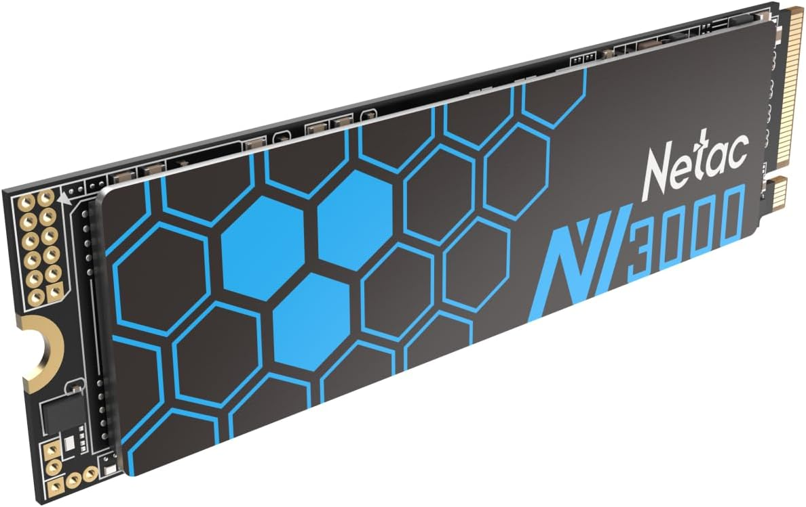
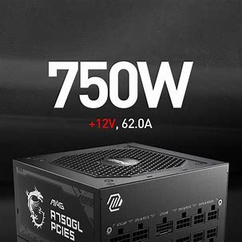

# Configuration Optimisée pour PC Gaming
numéro 2
Guillaume OZOUX
Salim SKANDER
Matheo ROUSSEL

Lorsqu'il s'agit d'optimiser les performances d'un PC, l'upgrade des composants clés peut apporter une nouvelle vie à votre système existant. Dans cette configuration initiale, le PC dispose d'une base solide avec la carte mère **MSI Z370 Gaming Plus**, un processeur **Intel i7-8700**, et une carte graphique **MSI GeForce GTX 1060 6G**. Cependant, avec l'évolution constante des technologies, l'opportunité d'améliorer le système se présente. Dans cette démarche d'upgrade, nous nous concentrerons sur le remplacement du ventirad, l'expansion du stockage SSD, une mise à niveau de la RAM, et l'ajout d'un NVMe pour un système plus performant et réactif tout en gardant un prix correct et abordable.

## Composants Upgrade : 201,83

-  **Cooler Master Hyper 212 Halo White**: Assure un refroidissement efficace du processeur, garantissant des températures stables même lors des sessions de gaming intensives.

-  **Samsung SSD 500 Go Evo**: Apporte une rapidité d'accès aux données exceptionnelle, réduisant les temps de chargement des jeux et améliorant la réactivité globale du système.

-  **Netac 500 Go NVMe SSD**: Ajout d'un NVMe pour une vitesse de stockage supérieure, améliorant la réactivité générale du système.

-  **Crucial Pro RAM DDR4 32 Go**: Offre une quantité généreuse de mémoire vive, permettant aux jeux modernes de s'exécuter en douceur sans compromettre les performances.

## Description :

Cette configuration optimisée est parfaitement adaptée aux exigences du gaming, offrant un équilibre judicieux entre performances et coût.

- **Cooler Master Hyper 212 Halo White 44,95€**: Assure un refroidissement efficace du processeur, garantissant des températures stables même lors des sessions de gaming intensives.

- **Samsung SSD 500 Go Evo 49,90€et Netac 500 Go NVMe SSD 35,99€**: Apportent une rapidité d'accès aux données exceptionnelle, réduisant les temps de chargement des jeux et améliorant la réactivité globale du système.

- **Crucial Pro RAM DDR4 32 Go 70,99€**: Offre une quantité généreuse de mémoire vive, permettant aux jeux modernes de s'exécuter en douceur sans compromettre les performances.

- **MSI GeForce GTX 1060 6G**: Une carte graphique puissante, créant un ensemble capable de gérer des titres graphiquement exigeants.

En résumé, cette configuration met l'accent sur la fluidité, la rapidité et la stabilité, garantissant une expérience de gaming immersive et sans accrocs, tout en restant abordable. Ces ajustements ciblés améliorent significativement les performances du PC, le positionnant comme une option solide pour les amateurs de jeux à la recherche d'une expérience immersive et fluide sans dépasser un budget raisonnable.

L'upgrade d'un PC est une étape cruciale pour rester compétitif avec les exigences toujours croissantes des logiciels et des jeux. En revisitant notre configuration initiale avec des composants tels que le Cooler Master Hyper 212 Halo White pour le refroidissement, le Samsung SSD 500 Go Evo pour un stockage plus étendu, la Crucial Pro RAM DDR4 32 Go pour une mémoire vive accrue, et le Netac 500 Go NVMe SSD pour une vitesse de stockage supérieure, notre PC est prêt à offrir des performances optimales dans un monde numérique en constante évolution. Ces ajustements ciblés garantissent une expérience informatique plus fluide, tout en respectant un budget raisonnable.

# Configuration Améliorée (budget augmenté)

## Nouvelle Configuration

- **Carte mère:** MSI PRO B760-P DDR4 II Micro-ATX (150€)
- **Processeur:** AMD Ryzen™ 7 7700 (340€)
- **Ventirad:** Ventirad inclus avec le processeur AMD
- **Alimentation:** MSI MAG A750GL 750W 80 Plus Gold (95€)
- **Carte Graphique:** Zotac Gaming GEFORCE RTX 3070 8GO (490€)
- **Stockage:**
  - SSD: Samsung SSD 500 Go EVO
  - NVMe: Netac 500 Go NVMe SSD
  - HDD: Seagate Barracuda 1 To
- **Boitier:** Cooler MasterBox TD500 Mesh (122€)

## Conclusion

Cette configuration améliorée représente une mise à niveau significative par rapport à la configuration initiale, offrant des performances de gaming bien supérieures grâce à la puissante carte graphique Zotac Gaming GEFORCE RTX 3070 8GO et au processeur AMD Ryzen™ 7 7700. Avec une alimentation MSI MAG A750GL 750W 80 Plus Gold et une carte mère MSI PRO B760-P DDR4 II Micro-ATX, la stabilité et l'efficacité énergétique sont assurées. Le stockage est amélioré avec un SSD Samsung 500 Go EVO et un NVMe Netac 500 Go pour des temps de chargement rapides. Le boîtier Cooler MasterBox TD500 Mesh avec ses trois ventilateurs intégrés garantit une excellente dissipation thermique. Cette configuration offre des performances exceptionnelles pour les jeux modernes et s'inscrit dans le budget de 1200€, offrant ainsi un excellent rapport qualité-prix.

